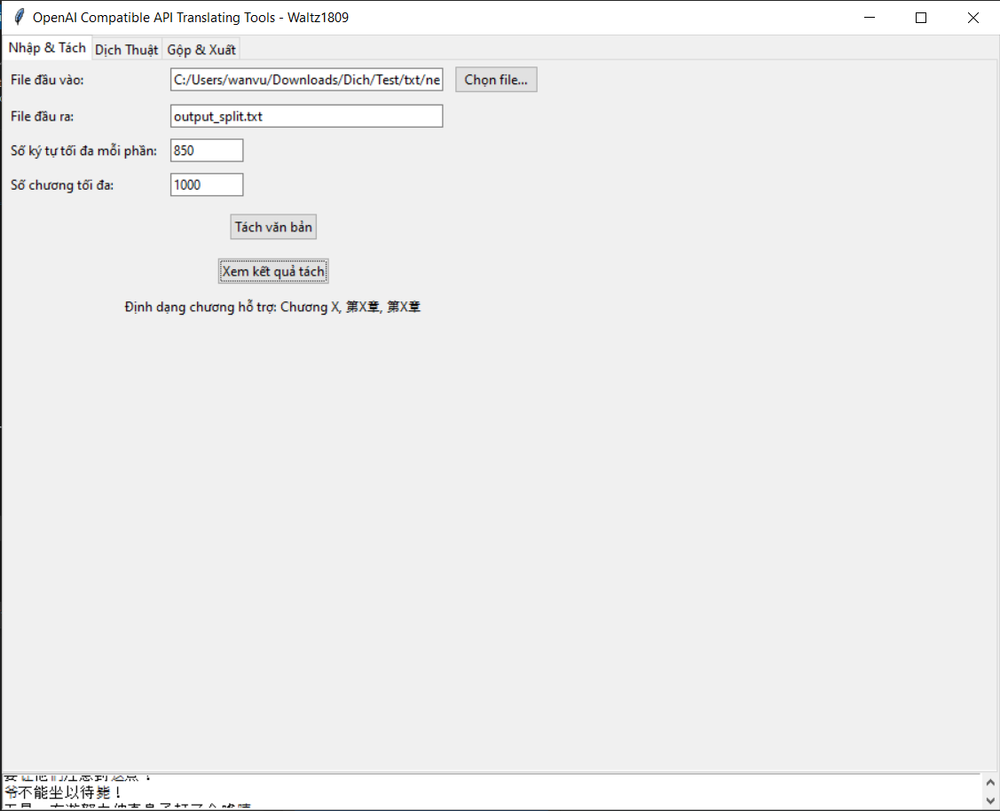
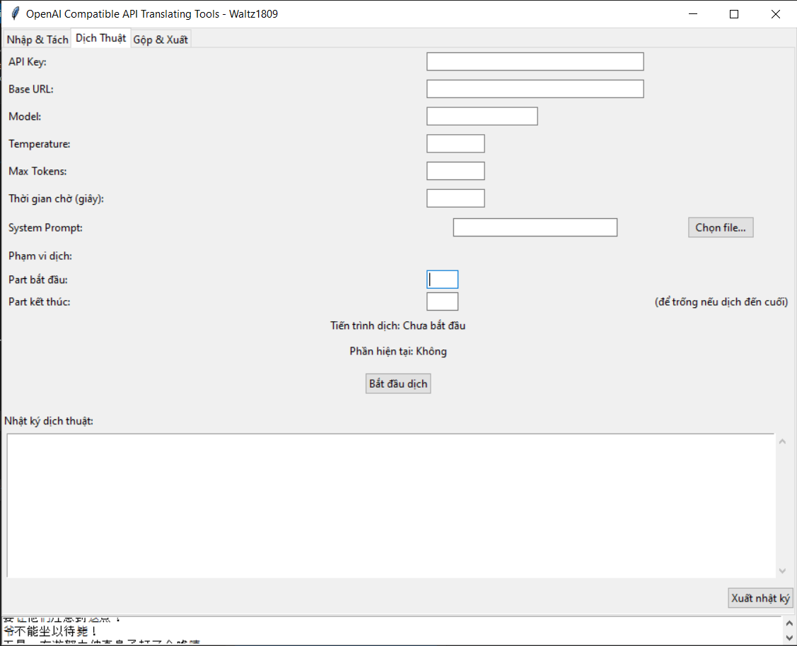
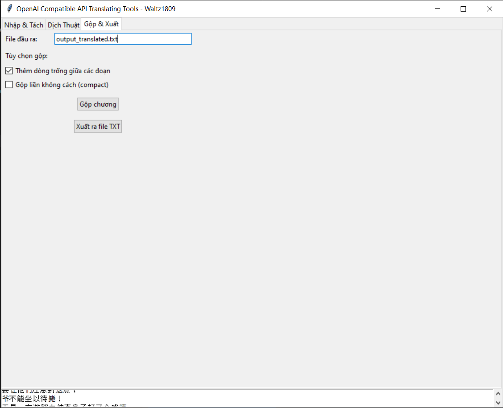

# Công Cụ Dịch Thuật bằng OpenAI API







## Giới Thiệu

Ứng dụng giúp tự động hóa quá trình dịch thuật văn bản từ tiếng Trung (hoặc các ngôn ngữ khác, miễn đúng định dạng) sang tiếng Việt sử dụng OpenAI API, với các tính năng:
- Tách văn bản thành các chương/part theo định dạng
- Hỗ trợ đa luồng khi gọi API dịch
- Gộp nội dung đã dịch với tuỳ chọn định dạng
- Theo dõi tiến trình qua giao diện trực quan
- Tương thích nhiều API miễn là dùng OpenAI SDK và Endpoint URL

## Yêu Cầu Hệ Thống

### Phiên Bản Đã Đóng Gói
- Windows 10/11 64-bit
- RAM: Tối thiểu 4GB
- Kết nối Internet để sử dụng OpenAI API

### Build Từ Source Code
- Python 3.8+
- Các thư viện cần thiết:

```text
openai          # Kết nối với OpenAI API
cn2an         # Chuyển đổi số Hán tự
```

## Hướng Dẫn Cài Đặt

### 1. Sử dụng file .exe

- Tải phiên bản mới nhất từ Release

### 2. Build từ Source Code

1. Cài đặt OpenAI và cn2an
```
pip install cn2an
pip install openai
```
2. Clone repo
```
https://github.com/Waltz1809/OpenAICompatibleAPITranslateTool.git
```
3. Chạy ứng dụng
```
python all_in_one.py
```

## Hướng Dẫn Sử Dụng

### 1. Tab Nhập & Tách:

Chọn file văn bản cần dịch

Thiết lập số ký tự tối đa/part

*Lưu ý: Nên set số chương tối đa là bao nhiêu, như vậy khi xử lý sẽ tránh việc nhầm giữa số trong nội dung chương với số chương.
Ví dụ: Chương 2 có dòng 2022... Chương trình có thể hiểu nhầm thành đó là chương 2022

Nhấn "Tách văn bản"

###  2. Tab Dịch Thuật:

Nhập OpenAI API key

Thiết lập thông số dịch (model, temperature,...)

Chọn phạm vi part cần dịch

Nhấn "Bắt đầu dịch"

### 3. Tab Gộp & Xuất:

Chọn định dạng xuất (có cách dòng/dính liền)

Nhấn "Gộp chương"

Xuất ra file TXT khi hoàn tất

### 4. Định Dạng Chương Hỗ Trợ

- Chương X
- chương X
- 第(số hán tự)章
- 第X章
- X
Với X là số chương

## Thông Tin Liên Hệ:
Vui lòng nhắn thẳng. Đừng kết bạn xong rồi lặng im

Discord: waltz1809. 
